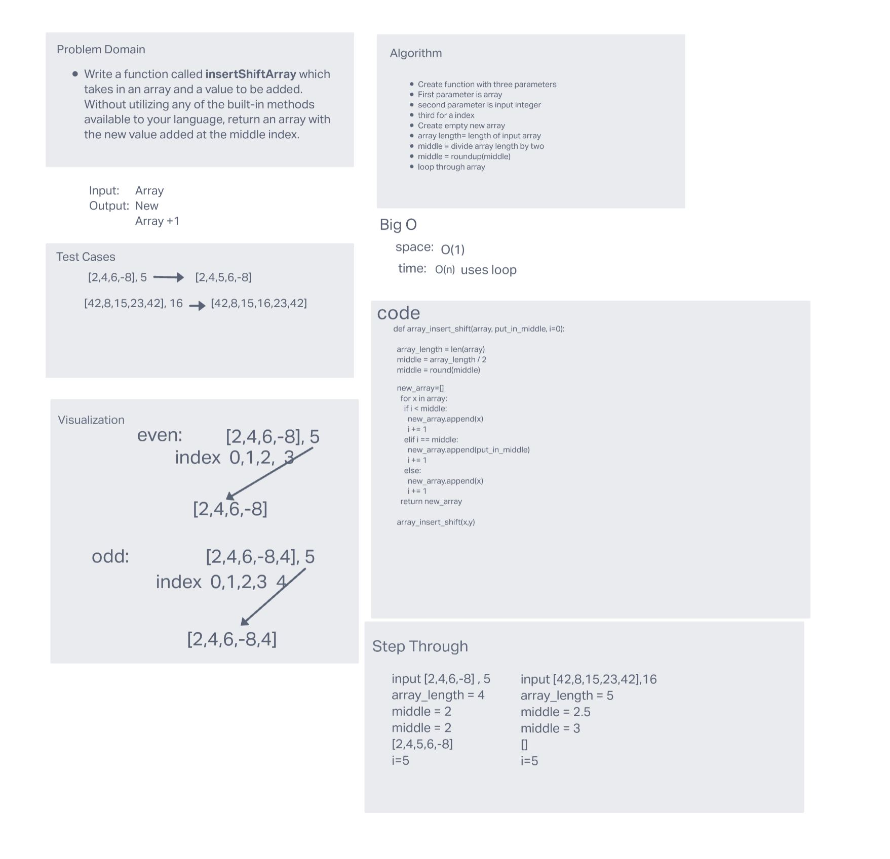

# Reverse an Array

Write a function called reverseArray which takes an array as an argument. Without utilizing any of the built-in methods available to your language, return an array with elements in reversed order

## Whiteboard Process

## Approach & Efficiency

The big O for this approach is O(N). The algorithm takes and array and finds its index length. It divides that length by two to find the middle. It then loops through the values appending them to a new array. When the index equals middle it appends a the supplied input
