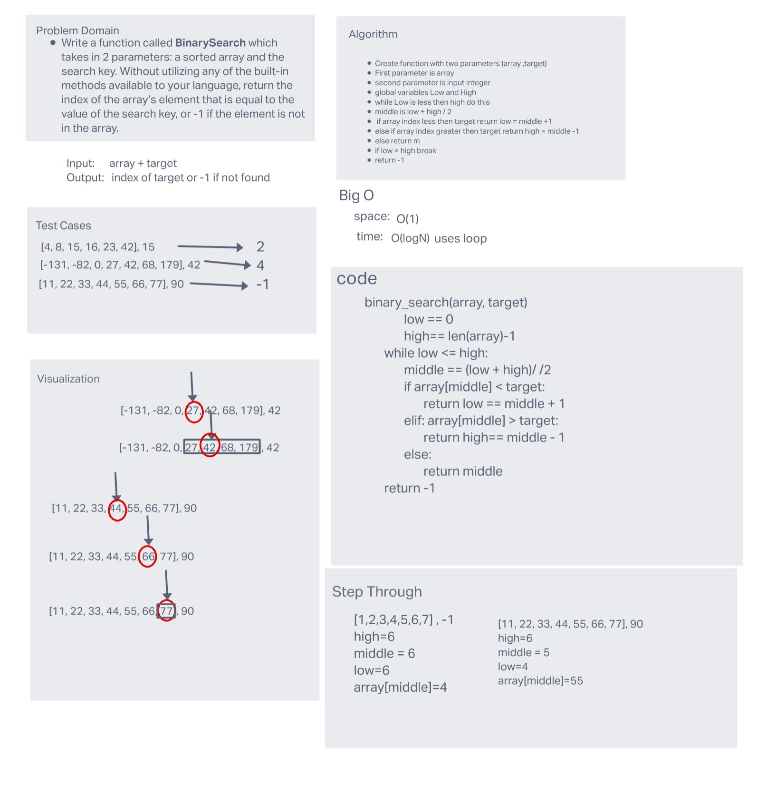

# Reverse an Array

Write a function called BinarySearch which takes in 2 parameters: a sorted array and the search key. Without utilizing any of the built-in methods available to your language, return the index of the array’s element that is equal to the value of the search key, or -1 if the element is not in the array.

## Whiteboard Process

## Approach & Efficiency

The big O for this approach is O(logN) and it has a space of O(1). This is because its reducing the array by half every step and the memory it takes up is constant. The algorithm takes in an sorted array and a target number. The algorithm splits the array checking whether the middle index value of the array is higher or lower then the target. It then adjusts the low or high, cutting the array in half and repeating the process till it finds the target value or returns -1 if target not found.
