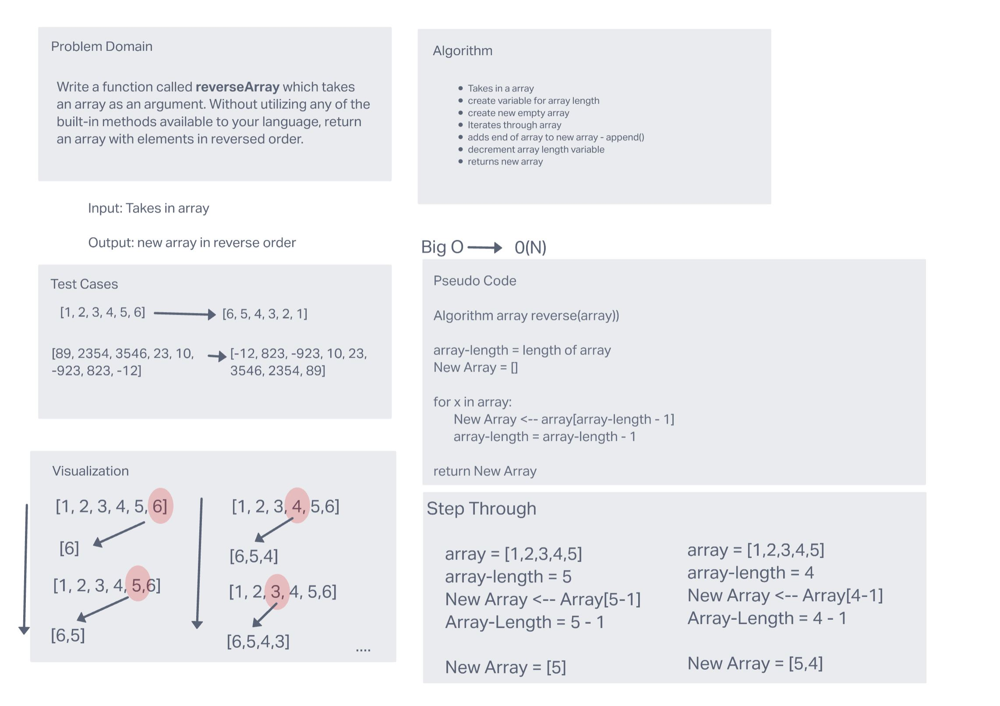

# Reverse an Array

Write a function called reverseArray which takes an array as an argument. Without utilizing any of the built-in methods available to your language, return an array with elements in reversed order

## Whiteboard Process

## Approach & Efficiency

The big O for this approach is O(N). The algorithm takes the end of the array and appends it to a new array. It does this by decrementing the array-length variable and using that variable work back through the array by index.
